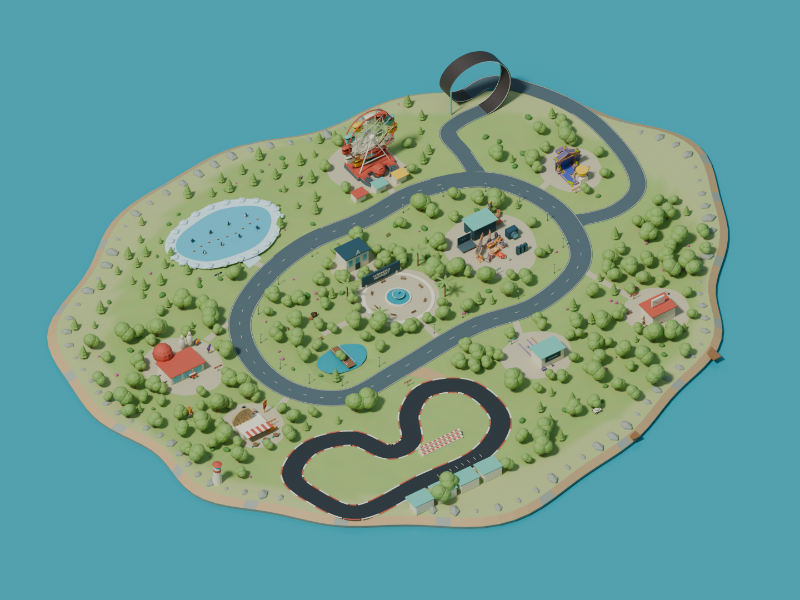

# Alejandro World · World Studio 03

Una isla compacta y editable para Alejandro Newport. El proyecto funciona localmente, con sus modelos, texturas, Three.js y Rapier dentro de esta carpeta. Portfolio se utiliza solamente como fuente de lectura; la aplicación no depende de su carpeta.



## Abrir

- **Start Driving.command** abre World Studio en `http://127.0.0.1:8844/preview/`. Empieza en **EDIT WORLD**.
- **Open Alejandro World.command** abre el mundo base en Blender y habilita el panel Alejandro World.
- **Open Edited World.command** abre una exportación del editor web en Blender. Primero pulsa **EXPORT GLB** en World Studio.
- **Run World Tests.command** ejecuta las comprobaciones de geometría, física, actividades World2 y paridad del coche.

También puedes ejecutar `python3 scripts/serve.py --open`. Necesita Python 3; la vista web necesita un navegador con WebGL2. El editor nativo se ha comprobado con Blender 4.5.13. No requiere cuentas ni conexión a servicios externos.

## Biblioteca World2 · versión 3

La categoría inicial **World2 · actividades** contiene 15 conjuntos completos: Bolos, circuito original World2, Proyectos, Baño, Achievements, Behind the scenes, Social, cronología de estudios/experiencia/proyectos, nombre Alejandro Newport en 3D, Cookies, Laboratorio, Altar, Máquina del tiempo, Controles y Hoguera. Las categorías World2 de conjuntos, objetos y naturaleza completan **179 entradas nuevas**.

Arrastra el conjunto al suelo o a la tierra que hayas creado. Muévelo, gíralo sobre Y y escálalo uniformemente. Selecciónalo antes de pulsar **DRIVE** para empezar en su punto de llegada original, trasladado a la nueva posición. Cada copia tiene sus propios cuerpos físicos, marcadores y reinicios. Los logros se comparten durante la partida. Acércate a los rombos de interacción y pulsa **E / Enter**. En Proyectos, A/D o flechas cambian de proyecto; Esc cierra el panel.

Bolos conserva diez pinos, bola, bumpers, strike y reset; el circuito conserva checkpoints, cuenta atrás y marcas; la cabina y las letras pueden caer; las líneas cronológicas suben al acercarte; Social mantiene los contactos y ventilador; el hoyo abre el terreno también en la física y lo restaura si lo mueves o borras. El circuito World2 conserva su tamaño original: crea suficiente tierra para colocarlo. El circuito compacto del mapa base sigue disponible.

**SAVE WORLD** conserva estos conjuntos y la tierra nueva. **EXPORT GLB** exporta geometría y materiales a Blender; las interacciones JavaScript se ejecutan en Drive dentro de World Studio. Para trasladar el proyecto con sus juegos, conserva toda la carpeta HelloWorld.

Validación: `npm run test:world2` (10 pruebas), `npm run test:handling` (paridad del coche) y `npm run test:physics` (10 recorridos y superficies). Informes en `reports/v3/`. La biblioteca, el terreno, el guardado/recarga y Drive/Simulate se comprobaron además en el navegador. Backup previo: `backups/pre-world2-library.zip`.

El contacto CV de Portfolio apunta a `/assets/alejandro-newport-cv.pdf`, pero ese PDF no existe en el proyecto de origen. Los enlaces originales se conservan; para habilitar esa descarga, coloca el archivo en `HelloWorld/assets/alejandro-newport-cv.pdf`.

## El mundo

Una única superficie costera de aproximadamente 224 × 188 m sustituye la composición anterior de extensiones separadas. Un bulevar orgánico recorre Projects, Achievements, la feria, el hielo, Bowling, Cookies y el acceso al circuito. La plaza central tiene fuente, palmeras, bancos y el rótulo Alejandro Newport; About se integra detrás. Career y Contact tienen edificios propios. El parque conserva una pequeña laguna y puente peatonal.

El circuito es una instalación independiente y simplificada, inspirada en Catalunya. Usa asfalto más oscuro y pianos rojos y crema. La noria conserva el modelo importado y sus doce cabinas, con un ciclo de treinta segundos. El loop es un ramal conectado al bulevar, sobre la misma isla.

Las carreteras se generan mediante polígonos y se recortan en sus cruces: no hay dos capas de asfalto superpuestas. Las huellas de los edificios principales se comprueban contra la calzada más un margen de 1,2 m. Los adornos pequeños tienen colisión desactivada; los elementos sólidos y objetos físicos mantienen sus colliders.

## Editar

Arrastra para orbitar, rueda para zoom y botón derecho para desplazar la cámara. Clic selecciona; Shift + clic añade a la selección. El contorno y el gizmo muestran la selección. Los edificios nuevos compuestos se agrupan para que puedan moverse y duplicarse completos.

- **G / W** mover; **R / E** rotar; **S** escalar; **F** enfocar.
- **⌘/Ctrl D** duplicar; **Suprimir** eliminar.
- **⌘/Ctrl Z** deshacer; **⌘/Ctrl Shift Z** rehacer.
- Biblioteca con miniaturas de geometría real, búsqueda y categorías. Arrastra un asset al suelo o pulsa su miniatura para colocarlo cerca del centro de la vista.
- Transformaciones numéricas, ground snap, alineación a superficie, cuadrícula de 1 m y giro de 15°.
- Color, roughness, metallic y textura local; modo físico, masa, fricción, restitución y colisión.
- Selecciona una tierra creada y pulsa **DRIVE** para aparecer sobre ella, aunque no tenga carretera.
- Selecciona una carretera para arrastrar sus puntos, añadir o eliminar puntos, extenderla, cambiar su ancho o añadir barreras.
- **⛰ → Create land** permite pintar tierra directamente sobre el mar. Ajusta Radius y Land height; **Erase land** elimina tierra creada. Raise, Lower, Smooth, Flatten y Paint modelan o pintan cualquier terreno. Esc termina el pincel.
- **SIMULATE** prueba física y animación sin conducir. Reset restaura los objetos físicos.

El navegador importa GLB y GLTF con recursos incorporados. Para FBX, OBJ o GLTF con archivos auxiliares, utiliza las herramientas de importación del panel Blender.

## Guardado y Blender

**SAVE WORLD** guarda `exports/editor-world.json`: transformaciones, geometría editada, materiales, física y modelos añadidos. La siguiente apertura lo restaura automáticamente. El guardado es atómico; la copia anterior queda en `backups/editor-world.previous.json`. Autosave es opcional y guarda cada treinta segundos mientras editas.

**EXPORT GLB** guarda además `exports/EditedWorld.glb`, con los recursos incorporados. **Open Edited World.command** lo convierte en `world/EditedWorld.blend`, con luces, cámara y física nativa. El mundo base `world/AlejandroWorld.blend` se conserva. Este paso explícito permite revisar los cambios del navegador antes de continuar en Blender.

El historial de deshacer se conserva durante la sesión; no se serializa al cerrar el navegador. Los cambios sí se guardan. Los guardados están vinculados a la geometría base: si ejecutas una reconstrucción completa, conserva primero tu GLB editado y tu JSON.

## Conducir

Pulsa **DRIVE**. **Esc** vuelve a la cámara y selección de edición. La física se reinicia al salir para mantener las posiciones de autoría.

| Tecla | Acción |
|---|---|
| W / S | Acelerar / frenar antes de dar marcha atrás |
| A / D | Dirección original de World2 |
| Espacio | Saltar, como en World2 |
| B / Ctrl | Frenar |
| Shift | Boost de Portfolio World2 |
| R | Reaparecer en la carretera más cercana y orientado con ella |
| C | Restaurar la cámara original de Portfolio |
| E / Enter | Interactuar; abrir proyecto cuando su panel está activo |
| H · 1–4 | Claxon · suspensiones hidráulicas |
| M · K | Mapa · logros |
| Tab | Mapa con zonas y posición del coche |

Se utilizan **Physics, PhysicsVehicle, Player, Inputs y View** del World2 actual, además del vehículo visual y sus materiales. Se mantienen las suspensiones, ruedas, fuerzas, frenada/reversa, masa, centro de masa, boost y cámara originales. Se eliminó la capa anterior de suavizado y drift. La comparación en dos mundos Rapier independientes reproduce 345 pasos de aceleración, dirección, boost, frenada, salto, marcha atrás e hidráulicos: diferencia máxima de posición **0 m**. Hielo, asistencia local del loop y reaparecer sobre carreteras editadas siguen siendo extensiones de HelloWorld.

El hielo reduce tanto el agarre como el frenado. Hay ocho pingüinos y conos físicos. El loop usa adherencia y orientación asistidas solamente dentro de su cinta; entra desde la izquierda con Shift. Una caída al agua recupera la última posición segura tras una pausa breve.

## Archivos y comprobaciones

- `world/AlejandroWorld.blend`: mundo nativo base, materiales e imágenes empaquetados, cámara **WORLD OVERVIEW**.
- `exports/AlejandroWorld.glb`: mundo web base con imágenes, animación y metadatos de física.
- `exports/layout.json`, `navigation.json`, `road-surfaces.json`: trazado y geometría de cruces.
- `preview/`: editor y conducción, con dependencias locales.
- `editor/alejandro_world/`: panel Blender, importación, colocación, curvas, materiales, física, validación y exportación.
- `assets/source-code/portfolio/`: copias de procedencia del código portado; no se cargan archivos del proyecto Portfolio durante la ejecución.
- `reports/v2-*.json`: resultados actuales; `reports/v2-overview.png`: render de la composición.
- `backups/v1-expanded/`: snapshot completo previo al rediseño, con manifiesto SHA-256.
- `folio-2025.blend` y `backups/hello_world_original.blend`: fuente original, intacta.

Las pruebas de conducción usan Rapier y las mallas exportadas reales, con un conductor automático que aplica acelerador, dirección y freno. Comprueban el bulevar, el circuito, el loop, hielo, impactos y el recorrido continuo completo. Las pruebas nativas comprueban empaquetado, física y cabinas verticales de la noria. `tests/check_assets.py` comprueba además la instantánea histórica de 477 archivos de Portfolio. Esa auditoría histórica detecta ahora cuatro diferencias fuera del código World2 portado (Journey, GlobalCanvas, .DS_Store y tsconfig.tsbuildinfo); no se han revertido ni modificado esos archivos. Los 44 archivos fuente usados en esta entrega coinciden con sus copias y hashes (`reports/v3/source-verification.json`).

Para reconstruir la versión 2 desde su snapshot local:

```sh
python3 scripts/v2/layout.py
python3 scripts/v2/road_geometry.py --plan-only
/Applications/Blender.app/Contents/MacOS/Blender --background --factory-startup --python scripts/v2/build.py
/Applications/Blender.app/Contents/MacOS/Blender --background world/AlejandroWorld.blend --python scripts/v2/finalize.py
```

Shapely está incluido en `scripts/vendor` para la generación y validación geométrica en este Mac; no participa en el editor ni en la conducción. El script de migración `scripts/v2/port.mjs` documenta la copia inicial desde Portfolio; no es necesario para ejecutar ni editar el proyecto.

Procedencia y licencias: [ASSET_SOURCES.md](ASSET_SOURCES.md).
